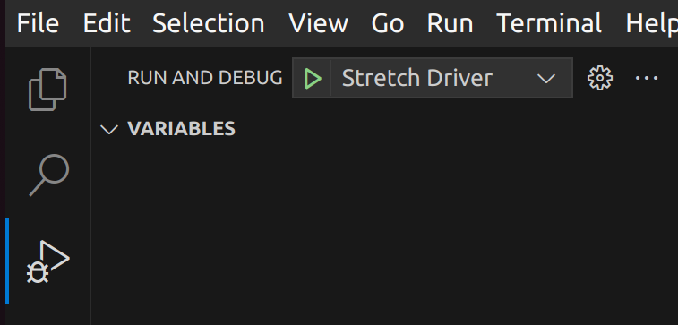
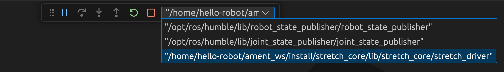
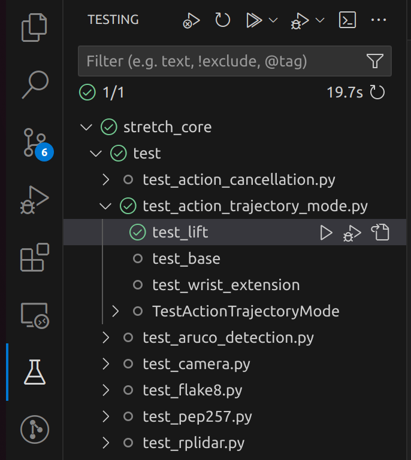

# Debugging in ROS

This tutorial explains how to debug Stretch ROS nodes.

## VSCode ROS Extension

You can debug ROS nodes using the [ROS extension](https://marketplace.visualstudio.com/items?itemName=ms-iot.vscode-ros).

1. Add this launch config to [`.vscode/launch.json`](../.vscode/launch.json):

```json
{
  "version": "0.2.0",
    "inputs": [
      {
        "type": "pickString",
        "id": "driverMode",
        "description": "What mode should Stretch Driver start in?",
        "options": [
          "position",
          "navigation",
          "trajectory",
          "gamepad"
        ],
        "default": "component"
      },
    ],
    "configurations": [
        {
            "name": "Stretch Driver",
            "type": "ros",
            "request": "launch",
            "target": "${workspaceFolder}/stretch_core/launch/stretch_driver.launch.py",
            "arguments": ["mode:=${input:driverMode}",]
        }
    ]
}
```

2. Add a `breakpoint()` statement in your code, where you want to the debugger to stop.

3. run `colcon build`

4. Run this launch config in VScode:

    

5. Choose a robot mode. The default value is `position`:

    

6. You will see the VSCode debugger bar at the top of your window. 

    

    The debugger should now stop at the breakpoint you specified.


## VSCode Testing

In addition to the Test Instructions in the `stretch_core` README, you can run tests from VSCode.

1. Install the [Python extension](https://marketplace.visualstudio.com/items?itemName=ms-python.python), if you haven't already.

2. Add these testing configs to [`.vscode/settings.json`](../.vscode/settings.json):

```json
{
  "python.testing.pytestEnabled": true,
  "python.testing.unittestEnabled": false,
  "python.testing.pytestArgs": [
      "stretch_core"
  ]
}
```

3. You will see tests show up in the Testing panel in VSCode:

    

> Note: Usually, reloading the VSCode window using `ctrl/cmd + shift + p` -> "Developer: Reload Window", helps make the tests appear when the Python extension does not automatically discover the tests.