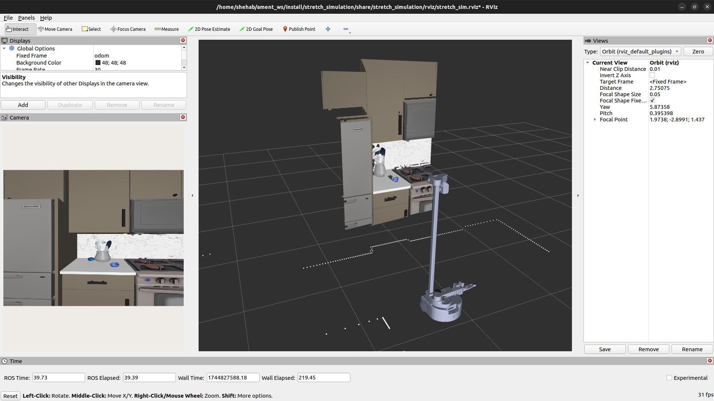

# Stretch Simulation in ROS2

Use this package to use ROS2 with Stretch in Mujoco.

## System Requirements

It is recommended to run this package on an Ubuntu 22.04 workstation with an Nvidia graphics card or a WSL2 environment with GPU acceleration. 

Minimum: 16GB of RAM. Recommended: 32GB of RAM.

This package is not supported on Metal (MacOS) at this time due to the lack of GPU acceleration and OpenGL 1.5+ support in Docker, and slow performance in UTM with a virtual machine.

## Nav2

First go through the [Getting Started](#getting-started) guide to set up your environment.

### Mapping

This section is similar to https://docs.hello-robot.com/0.3/ros2/navigation_stack/#mapping, but uses the Stretch simulation environment.

To map the simulated environment, run the following:

```shell
# Terminal 1: Slam Toolbox
ros2 launch stretch_nav2 online_async_launch.py use_sim_time:=true 
# Optional: Navigation bringup:
ros2 launch stretch_nav2 navigation.launch.py use_slam:=true use_sim_time:=true use_rviz:=true teleop_type:=none

# Terminal 2: Stretch Mujoco Driver
export MUJOCO_GL=egl # On Ubuntu, tell Mujoco to use the GPU
ros2 launch stretch_simulation stretch_mujoco_driver.launch.py use_mujoco_viewer:=true mode:=navigation

# Terminal 3: Keyboard Teleop
ros2 service call /switch_to_navigation_mode std_srvs/srv/Trigger
ros2 run teleop_twist_keyboard teleop_twist_keyboard --ros-args --remap cmd_vel:=/stretch/cmd_vel
```

To save your map, run:

```sh
mkdir ${HELLO_FLEET_PATH}/maps
ros2 run nav2_map_server map_saver_cli -f ${HELLO_FLEET_PATH}/maps/<map_name>
```

### Navigation

To run navigation on a previously generated map, run:

```sh
# Terminal 1: Stretch Mujoco Driver
ros2 launch stretch_simulation stretch_mujoco_driver.launch.py use_mujoco_viewer:=true use_rviz:=false mode:=navigation

# Terminal 2: Navigation
ros2 service call /switch_to_navigation_mode std_srvs/srv/Trigger

ros2 launch stretch_nav2 navigation.launch.py map:=${HELLO_FLEET_PATH}/maps/<map_name>.yaml use_sim_time:=true use_rviz:=true teleop_type:=none
```

You may want to dynamically reduce the cost_map inflation radius for most Robocasa environments:

```shell
ros2 param get /global_costmap/global_costmap inflation_layer.inflation_radius
ros2 param get /local_costmap/local_costmap  inflation_layer.inflation_radius

ros2 param set /global_costmap/global_costmap inflation_layer.inflation_radius 0.20
ros2 param set /local_costmap/local_costmap  inflation_layer.inflation_radius 0.20
```

#### Pre-mapped scene

There are [maps](./maps/) included in this package that you can use with navigation out of the box.

Launch the pre-mapped environment using the following commands:

```shell
# Terminal 1
ros2 launch stretch_simulation stretch_mujoco_driver.launch.py use_mujoco_viewer:=true mode:=navigation robocasa_layout:='G-shaped' robocasa_style:=Modern_1

# Terminal 2
ros2 launch stretch_nav2 navigation.launch.py map:=~/ament_ws/src/stretch_ros2/stretch_simulation/maps/gshaped_modern1_robocasa.yaml use_sim_time:=true use_rviz:=true teleop_type:=none

# Terminal 3
ros2 service call /stow_the_robot std_srvs/srv/Trigger
ros2 param set /global_costmap/global_costmap inflation_layer.inflation_radius 0.20
ros2 param set /local_costmap/local_costmap  inflation_layer.inflation_radius 0.20
```

### Web Teleop

You can use Stretch Web Teleop with the Stretch Simulation environment! 


Before you start, install the dependencies for Stretch Web Teleop by following these [instructions](#setting-up-stretch-web-teleop).


Use the following commands to start Stretch Mujoco with Web Teleop:
```shell
parallel_terminal="gnome-terminal --tab -- /bin/bash -c " # or "xterm -e"

# Terminal 1
$parallel_terminal "MUJOCO_GL=egl ros2 launch stretch_simulation stretch_mujoco_driver.launch.py use_mujoco_viewer:=false mode:=position robocasa_layout:='G-shaped' robocasa_style:=Modern_1 use_rviz:=false use_cameras:=true map:=~/ament_ws/src/stretch_ros2/stretch_simulation/maps/gshaped_modern1_robocasa.yaml" &

# Terminal 2
$parallel_terminal "ros2 launch stretch_simulation stretch_simulation_web_interface.launch.py" &

# Terminal 3
$parallel_terminal "cd ~/ament_ws/src/stretch_web_teleop; npm run localstorage" &

# Terminal 4
$parallel_terminal "cd ~/ament_ws/src/stretch_web_teleop; sudo node ./server.js" &

# Terminal 4
$parallel_terminal "cd ~/ament_ws/src/stretch_web_teleop; node start_robot_browser.js" &
```

## Cameras and PointClouds

Please use the `use_cameras:=true` argument to enable cameras and pointclouds. e.g. `ros2 launch stretch_simulation stretch_mujoco_driver.launch.py use_mujoco_viewer:=true mode:=navigation use_cameras:=true`

There are five camera topics being published:
- RGB and Depth for the D405 camera in the gripper.
- RGB and Depth or the D435i camera in the head.
- RGB for the wide-lens camera in the head.

The RGB and Depth frames are used to create two PointCloud2 topics as well.




## Stretch Drivers

Simulation Drivers interface with the simulator to read and write data.

Simulation Drivers mimic the StretchDriver in `stretch_core`, which talks to the real robot. 

You could display all the launch options available to the Stretch Mujoco Driver using: `ros2 launch stretch_simulation stretch_mujoco_driver.launch.py --show-args`:

```
    'broadcast_odom_tf':
        Whether to broadcast the odom TF. Valid choices are: ['True', 'False']
        (default: 'True')

    'fail_out_of_range_goal':
        Whether the motion action servers fail on out-of-range commands. Valid choices are: ['True', 'False']
        (default: 'False')

    'mode':
        The mode in which the ROS driver commands the robot. Valid choices are: ['position', 'navigation', 'trajectory', 'gamepad']
        (default: 'position')

    'use_rviz':
        One of: ['true', 'false']
        (default: 'true')

    'use_mujoco_viewer':
        One of: ['true', 'false']
        (default: 'true')

    'use_cameras':
        One of: ['true', 'false']
        (default: 'false')

    'use_robocasa':
        One of: ['true', 'false']
        (default: 'true')

    'robocasa_task':
        no description given
        (default: 'PnPCounterToCab')

    'robocasa_layout':
        One of: ['Random', 'One wall', 'One wall w/ island', 'L-shaped', 'L-shaped w/ island', 'Galley', 'U-shaped', 'U-shaped w/ island', 'G-shaped', 'G-shaped (large)', 'Wraparound']
        (default: 'Random')

    'robocasa_style':
        One of: ['Random', 'Industrial', 'Scandanavian', 'Coastal', 'Modern_1', 'Modern_2', 'Traditional_1', 'Traditional_2', 'Farmhouse', 'Rustic', 'Mediterranean', 'Transitional_1', 'Transitional_2']
        (default: 'Random')

```

You can also set the node's argument`arguments=["--ros-args", "--log-level", "debug"]` in the launch file to display Sim-to-Real time and other useful debug information.

## Getting Started

You should go through all the sections in Getting Started to run this package correctly.

> NOTE: If you are running on a Stretch robot, you can skip to [Setting up Mujoco](#setting-up-mujoco-15-minutes)

Estimated install time: `~1-2hrs`.

### Install ROS2 Humble (10 minutes)

> NOTE: Please do not run this step if you are running on a Stretch robot.

The commands below are taken from this guide: https://docs.ros.org/en/humble/index.html

```shell
sudo apt install software-properties-common
sudo add-apt-repository universe

sudo apt update && sudo apt install curl -y
sudo curl -sSL https://raw.githubusercontent.com/ros/rosdistro/master/ros.key -o /usr/share/keyrings/ros-archive-keyring.gpg

echo "deb [arch=$(dpkg --print-architecture) signed-by=/usr/share/keyrings/ros-archive-keyring.gpg] http://packages.ros.org/ros2/ubuntu $(. /etc/os-release && echo $UBUNTU_CODENAME) main" | sudo tee /etc/apt/sources.list.d/ros2.list > /dev/null

sudo apt update

sudo apt install ros-humble-desktop ros-dev-tools rviz python3-pip

source /opt/ros/humble/setup.bash
```

### Setting up `ament_ws` (1 hour)

> NOTE: Please do not run this step if you are running on a Stretch robot.

If you are not running this package on a robot NUC (which is _not_ [recommended](#system-requirements)), you will need to set up a ROS2 environment similar to the environment that ships with Stretch.

Please run these commands to install the environment. This will delete the existing `~/ament_ws` directory, so please proceed with caution.

First you should install `NodeJS>=21.x` and `npm` if you don't already have them:
```shell
curl -sL https://deb.nodesource.com/setup_22.x | sudo -E bash -
sudo apt install -y nodejs
```

```sh

curl -sL https://raw.githubusercontent.com/hello-robot/stretch_ros2/refs/heads/humble/stretch_simulation/stretch_create_ament_workspace.sh > /tmp/stretch_create_ament_workspace.sh && sudo bash /tmp/stretch_create_ament_workspace.sh

# Optional: add source install/setup.bash to .bashrc:
echo 'source ~/ament_ws/install/setup.bash' >> ~/.bashrc
```


> Note: If you run into a colcon build error: "fatal error: numpy/ndarrayobject.h: No such file or directory", run `sudo ln -s ~/.local/lib/python3.10/site-packages/numpy/core/ /usr/include/numpy` to resolve it.


A successful `ament_ws` setup will look like this:
```
$ ls ~/ament_ws/src
audio_common  realsense-ros  respeaker_ros2  ros2_numpy  rosbridge_suite  sllidar_ros2  stretch_ros2  stretch_tutorials  stretch_web_teleop  tf2_web_republisher_py
```

### Setting up URDF (15 minutes)

Run the commands below or follow the instruction in the [`stretch_description #updating-the-urdf`](../stretch_description/README.md#updating-the-urdf) README file to set up the URDF meshes.

```shell
source ~/ament_ws/install/setup.bash

python3 -m pip install -U hello-robot-stretch-urdf

git clone https://github.com/hello-robot/stretch_urdf.git --depth 1 /tmp/stretch_urdf

python3 -m pip install hello-robot-stretch-body

python3 /tmp/stretch_urdf/tools/stretch_urdf_ros_update.py
python3 /tmp/stretch_urdf/tools/stretch_urdf_ros_update.py --ros2_rebuild
```

A successful URDF update will look like this:
```
$ ls ~/ament_ws/src/stretch_ros2/stretch_description/urdf/
d405                             stretch_aruco.xacro     stretch_description_SE3_eoa_wrist_dw3_tool_nil.xacro          stretch_head_nav_cam.xacro        stretch_tool_sg3.xacro
d435i                            stretch_base_imu.xacro  stretch_description_SE3_eoa_wrist_dw3_tool_sg3.xacro          stretch_laser_range_finder.xacro  stretch_tool_tablet_12in.xacro
export_urdf_license_template.md  stretch_d405_sg3.xacro  stretch_description_SE3_eoa_wrist_dw3_tool_tablet_12in.xacro  stretch_main.xacro                stretch_uncalibrated.urdf
export_urdf.sh                   stretch_d435i.xacro     stretch_description.xacro                                     stretch_respeaker.xacro           stretch_wrist_dw3.xacro
```

### Setting up Mujoco (15 minutes)

This ROS 2 package includes nodes and launch files that use the [`stretch_mujoco`](https://github.com/hello-robot/stretch_mujoco) repo to interface with Mujoco.

Run the following, after having done the previous ament_ws setup steps, to start interacting with Stretch in Mujoco using ROS 2:

```shell
pip3 install --upgrade pip #This is important after a fresh install of Ubuntu, for edittable installation of dependencies

source ~/ament_ws/install/setup.bash
# This script is interactive, it will ask you if you want to install robocasa model files:
sh ~/ament_ws/src/stretch_ros2/stretch_simulation/stretch_mujoco_driver/setup.sh

pip install PyOpenGL==3.1.4 # Fixes AttributeError: module 'OpenGL.EGL' has no attribute 'EGLDeviceEXT'

cd ~/ament_ws
source ./install/setup.bash
colcon build
ros2 launch stretch_simulation stretch_mujoco_driver.launch.py mode:=navigation
```


### Setting up Stretch Web Teleop

Make sure you've already completed everything under [Setting up `ament_ws`](#setting-up-ament_ws) above.

Run the following commands to get IK for the gripper working:
```shell
cd stretch_description/urdf
cp ./stretch_uncalibrated.urdf stretch.urdf

sudo apt install rpl
./export_urdf.sh # It's okay if it fails on calibrated params

mkdir -p $HELLO_FLEET_PATH/$HELLO_FLEET_ID/exported_urdf
cp -r ./exported_urdf/* $HELLO_FLEET_PATH/$HELLO_FLEET_ID/exported_urdf
```